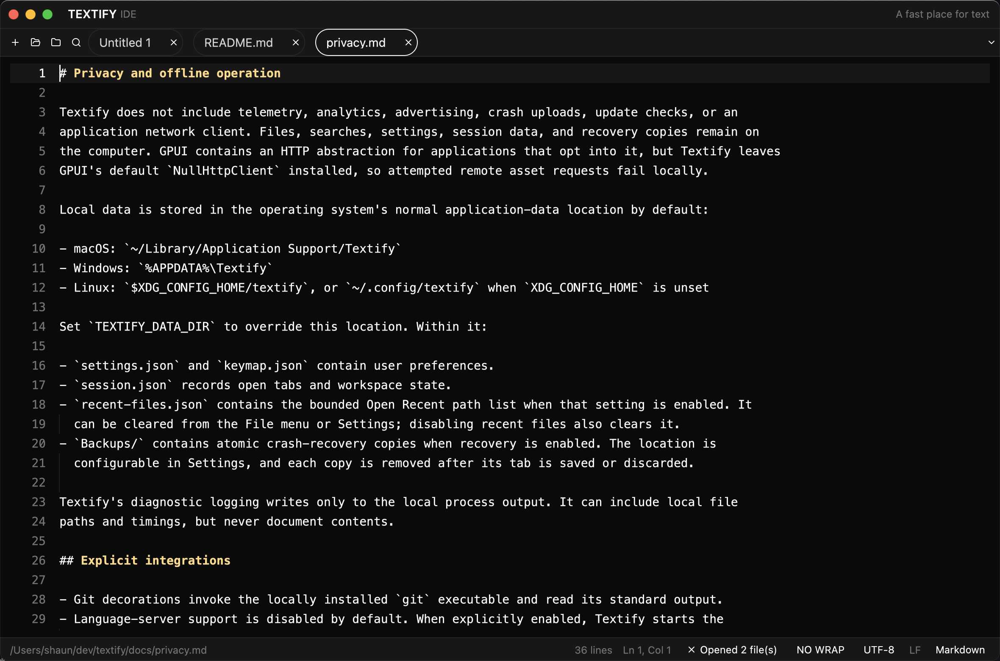

# Textify

A native text editor for macOS, Linux, and Windows. Textify is written in Rust and uses GPUI for
the interface.



Textify handles ordinary text and source files, plus files too large to load into a normal editor.
It has tabs, syntax highlighting, a project explorer, workspace search, multiple cursors, crash
recovery, and optional language-server support. It does not include telemetry, an update checker,
or an application network client.

## Download

Ready-to-run builds are attached to [GitHub Releases](https://github.com/scpedicini/textify/releases).

| Platform | File | Notes |
| --- | --- | --- |
| macOS 14 or later | `textify-<version>-macos-universal.zip` | Runs on Apple silicon and Intel Macs |
| Windows x64 | `textify-<version>-windows-x64-setup.exe` | Per-user installer, no administrator access required |
| Windows x64 | `textify-<version>-windows-x64.zip` | Portable executable |
| Ubuntu/Debian x64 | `textify-<version>-linux-amd64.deb` | Installs the desktop entry, icon, and file associations |
| Linux x64 | `textify-<version>-linux-x64.tar.gz` | Portable archive |

The macOS and Windows builds are not signed yet. Gatekeeper or SmartScreen may warn when you open
them. Each release includes `SHA256SUMS` so you can check the downloaded files.

On macOS, unzip the app and move it to Applications. If Gatekeeper blocks the first launch,
Control-click Textify, choose Open, then confirm. On Windows, the portable archive can be extracted
anywhere; the installer places Textify under your local application-data directory. On Debian or
Ubuntu, install the package with:

```sh
sudo apt install ./textify-<version>-linux-amd64.deb
```

## Using Textify

Open individual files with the file picker, by dropping them on the window, or by passing paths on
the command line. Open a folder to use the project explorer and workspace search. Textify restores
open tabs and the last workspace when it starts again.

Common shortcuts use Command on macOS and Control on Windows/Linux:

| Action | macOS | Windows/Linux |
| --- | --- | --- |
| Open file | Command-O | Control-O |
| Open folder | Command-Shift-O | Control-Shift-O |
| Save | Command-S | Control-S |
| Search open tabs | Command-P | Control-P |
| Search workspace | Command-Shift-F | Control-Shift-F |
| Command palette | Command-Shift-P | Control-Shift-P |
| Find an open tab | Command-Option-P | Control-Alt-P |
| Add another cursor | Command-click | Control-click |
| Settings | Command-, | Control-, |

Option-drag creates a rectangular selection. Use Alt-drag on Windows and Linux. The command palette
also exposes commands that do not have a shortcut.

Text files at or above 512 MiB open in a separate read-only viewer. It pages through the file with
bounded memory and supports streaming search, line or byte navigation, copying selected lines, and
opening a smaller range in an editable tab. See [docs/huge-files.md](docs/huge-files.md) for the
limits and behavior.

## Settings and local data

Textify creates `settings.json` and `keymap.json` after its first window appears. Both files reload
when saved. Their default location is:

| Platform | Directory |
| --- | --- |
| macOS | `~/Library/Application Support/Textify` |
| Windows | `%APPDATA%\Textify` |
| Linux | `$XDG_CONFIG_HOME/textify`, or `~/.config/textify` |

Set `TEXTIFY_DATA_DIR` to use a different directory. The settings schema, keymap format, project
rules, Git decorations, and language-server setup are documented in
[docs/ide-workflows.md](docs/ide-workflows.md). [docs/privacy.md](docs/privacy.md) lists every local
file Textify writes and explains the boundary around optional language servers.

## Build from source

The repository pins Rust 1.93.1. Clone it with its vendored GPUI Component fork, then run:

```sh
cargo run --locked
```

GPUI renders through Metal on macOS, Vulkan on Linux, and Direct3D on Windows. Linux needs the
Wayland/X11, Fontconfig, and Vulkan development libraries installed by
[`scripts/install-linux-build-deps.sh`](scripts/install-linux-build-deps.sh). Windows builds need
the MSVC build tools and Windows SDK.

For an optimized local macOS app and terminal symlink:

```sh
./scripts/install-local.sh
```

Packaging commands and the release workflow are in [docs/deployment.md](docs/deployment.md).

## Check a change

```sh
cargo fmt --all -- --check
cargo test --locked --workspace --all-targets -- --test-threads=1
cargo clippy --locked --workspace --all-targets -- -D warnings
```

The large-file performance corpus runs with `cargo run --release --bin textify-perf`. Recorded
measurements and the test method are in [docs/performance.md](docs/performance.md).

## Contributing

Bug reports and focused pull requests are welcome. Read [CONTRIBUTING.md](CONTRIBUTING.md) before
starting a change. The vendored `gpui-component` directory contains a small Textify-specific fork;
its local changes are recorded in
[`vendor/gpui-component/TEXTIFY_FORK.md`](vendor/gpui-component/TEXTIFY_FORK.md).

Textify is available under the [MIT License](LICENSE).
